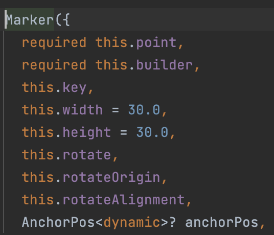
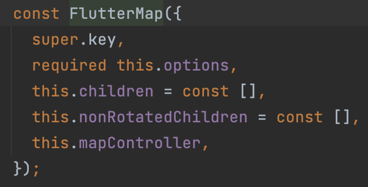
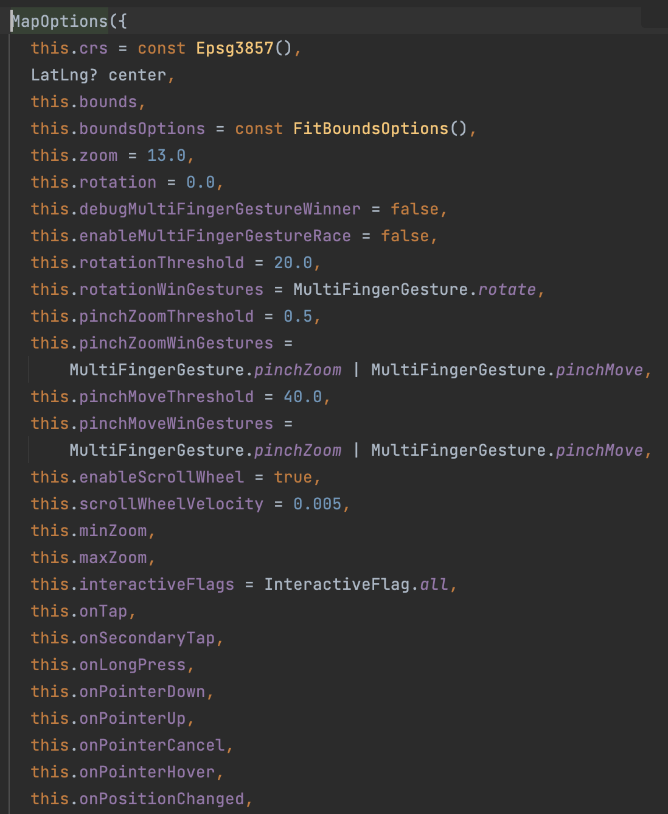
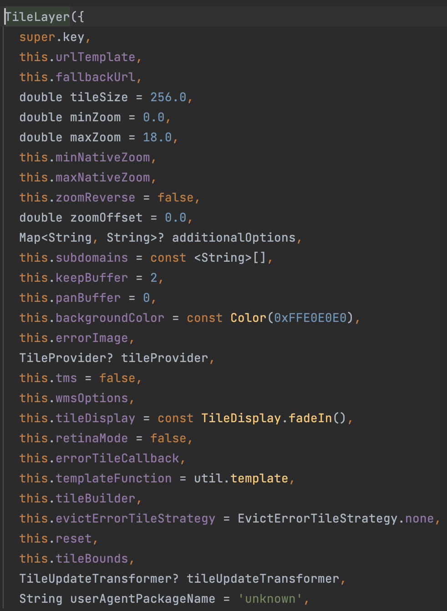
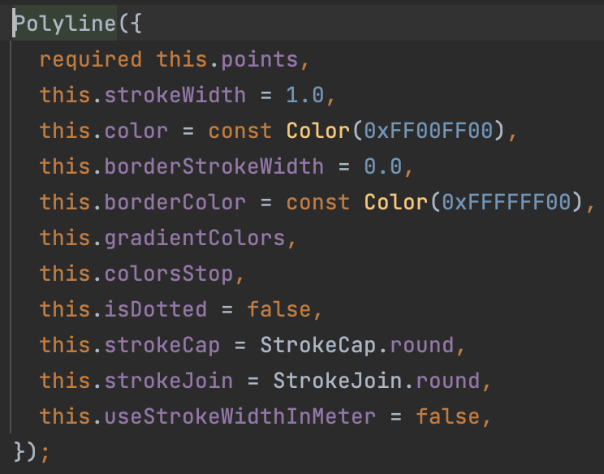

# flutter_map_package

A new Flutter project.

## Getting Started

This project is a starting point for a Flutter application.

A few resources to get you started if this is your first Flutter project:

- [Lab: Write your first Flutter app](https://docs.flutter.dev/get-started/codelab)
- [Cookbook: Useful Flutter samples](https://docs.flutter.dev/cookbook)

For help getting started with Flutter development, view the
[online documentation](https://docs.flutter.dev/), which offers tutorials,
samples, guidance on mobile development, and a full API reference.

## 1. Research: Flutter Map Package

- Keywords:
    - Flutter map package
    - flutter map example
    - flutter map github
    - flutter map tutorial
    - flutter map marker
    - flutter_map offline
    - flutter map openstreetmap
    - flutter map example github
    - flutter map widget
    - flutter mapbox
    - flutter map template
    - flutter_map mapbox
    - flutter map ontap
    - flutter map navigation
    - flutter map marker icon
    - custom marker google maps flutter
    - flutter map polyline
- Video Title: Flutter Map Package - Flutter Map using Mapbox GL and Openstreetmap with markers and
  polyline

## 2. Research: Competitors

**Flutter Videos/Articles**

- 19K: https://youtu.be/oAsuojCw-F4
- 30K: https://youtu.be/otWy4QhMJMo
- 26K: https://youtu.be/gaKvL88Zws0
- 25K: https://youtu.be/hZwrcOTxDJI
- 1.2K: https://youtu.be/95EeTtZoMho
- 1.9K: https://youtu.be/fPKGtuPWf-g
- https://pub.dev/packages/flutter_map
- https://pub.dev/documentation/flutter_map/latest/
- https://dhruvnakum.xyz/flutter-mapbox-integration-complete-guide-with-example

**Android/Swift/React Videos**

- 1K: https://www.youtube.com/watch?v=2jOAStzmPcM
- 1K: https://www.youtube.com/watch?v=jJamy2XJNuk
- 3K: https://www.youtube.com/watch?v=0OTk6KFsTvU
- 871: https://www.youtube.com/watch?v=BkKLMs5_fCk
- 834: https://www.youtube.com/watch?v=i5ZHi9OTfaA
- 721: https://www.youtube.com/watch?v=977cTDqB_8I
- 106: https://www.youtube.com/watch?v=Xw0haMrTRbY
- 4.1K: https://www.youtube.com/watch?v=HXP12DNwoLQ
- 11K: https://www.youtube.com/watch?v=dKhaQScITEw
- 4.6K: https://www.youtube.com/watch?v=ojDB7Qt_6U8
- https://docs.mapbox.com/android/maps/guides/
- https://www.kodeco.com/378151-mapbox-tutorial-for-android-getting-started
- https://docs.mapbox.com/ios/maps/guides/
- https://github.com/mapbox/mapbox-maps-ios
- https://www.createwithswift.com/tutorial-integrating-mapbox-with-swiftui/
- https://cocoapods.org/pods/Mapbox-iOS-SDK
- https://docs.mapbox.com/help/glossary/maps-sdk-for-react-native/
- https://www.npmjs.com/package/@react-native-mapbox-gl/maps
- https://www.waldo.com/blog/mapbox-react-native
- https://www.codementor.io/@danielamah/ultimate-guide-to-integrating-react-native-with-mapboxgl-a-google-map-alternative-19zkltyrqz

**Great Features**

- flutter_map package is versatile, simple, easy, customizable and configurable.
- Find more features at [pub.dev](https://pub.dev/packages/flutter_map).

**Problems from Videos**

- Question: How can we get our location automatically without describing lat or long?

Answer: You need to add a geolocator in your app so it gets your location automatically when you
open your app and add it directly to the map.

- Question: How to use the animation camera in the flutter map that is in the google map?

Answer: You need to create a Map controller and adding it to the map. Then using the controller you
can animate the camera to move around.

**Problems from Flutter Stackoverflow**

- https://stackoverflow.com/questions/76029128/flutter-unable-to-load-assets-for-flutter-map
- https://stackoverflow.com/questions/74885258/flutter-mapbox-error-cant-read-layers-tilelayers
- https://stackoverflow.com/questions/55959492/simple-flutter-app-with-flutter-map-is-not-working
- https://stackoverflow.com/questions/75957489/how-to-display-a-random-flutter-map
- https://stackoverflow.com/questions/65594126/why-does-centering-a-flutter-map-not-work
- https://stackoverflow.com/questions/56166809/flutter-map-current-location-the-following-nosuchmethoderror-was-thrown-buildi

## 3. Video Structure

**Main Points / Purpose Of Lesson**

1. In this video, you will learn how to use flutter_map package to use your own customizable and
   configurable flutter plugin.
2. Main points:
    - Polyline Markers
    - Map Controller
3. You can also use [openstreetmap](https://docs.fleaflet.dev/) to show map using flutter_map
   package.

**The Structured Main Content**

1. Run `dart pub add flutter_map` in terminal to add flutter_map package in your project's
   pubspec.yaml file.
2. Also run `dart pub add latlong2` in terminal to add latlong2 package to use latitude and
   longitude in flutter_map package.
3. I have used [mapbox](https://www.mapbox.com/) to use the API of maps. You can use also
   use [openstreetmap](https://www.openstreetmap.org/) for maps API and its
   docs [here](https://docs.fleaflet.dev/).
4. Output of this project is following: <br/>
   
5. Signup on [mapbox](https://www.mapbox.com/) if you don't have already an account.
    - After sign up, go to [access tokens page](https://account.mapbox.com/access-tokens/) and copy
      the default public token.
    - You can find the style of map [here](https://docs.mapbox.com/api/maps/styles/).
6. `main.dart` contains MaterialApp with theming properties of app and home of MaterialApp is
   calling HomePage widget.
7. `home_page.dart` contains two ElevatedButton in a column.
    - One button is for Polyline and Markers Page.
    - Second button is for Map Controller Page.
8. `app_constants.dart` file contains mapBoxAccessToken, urlTemplate, and
   some [styles](https://docs.mapbox.com/api/maps/styles/).
9. In `polyline_markers_page.dart` file, initialize following:

```dart

List<LatLng> tappedPoints = [
  LatLng(51.5, -0.09),
  LatLng(51.506678, -0.097124),
];
```

Then map these latitude and longitude values to list named markers:

It is list of markers. Marker has many properties.


`point` and `builder` properties of marker are required.

`point` accepts latitude and longitude.

`builder` has `context` for callback and used to draw any widget for markers on map page.

```dart

var markers = tappedPoints
    .map(
      (latlng) =>
      Marker(
        point: latlng,
        builder: (_) =>
        const Icon(
          Icons.pin_drop,
          color: Colors.red,
          size: 30,
        ),
      ),
)
    .toList();
```

In body, call `FlutterMap` widget. It has four parameters:


- `options` property of FlutterMap is required. It accepts `MapOptions` widget. It has many
  properties like center, minZoom, maxZoom, zoom, onTap, and many more.
  

  onTap of MapOptions is used here to add new points in tappedPoints list which then returns Marker
  for each tappedPoint item.
- `children` property of FlutterMap may contains `TileLayer`, `MarkerLayer`, and `PolylineLayer`.
    - `TileLayer` has many properties.
      
        - `urlTemplate` accepts string and used for template of map.
        - `additionalOptions` accepts Map<String, String>. First value is `accessToken` which is
          public key from mapbox account. Second value is `id`, which is style of map(i.e., in dark
          mode, street mode, etc). You can find style for
          mapbox [here](https://docs.mapbox.com/api/maps/styles/).
    - `MarkerLayer` has `marker` property accepts List of Markers which is from tappedPoints list of
      markers.`
    - `PolyLineLayer` has `polylines` property which accepts `List<Polyline>`. `Polyline` has many
      properties like points, strokeWidth, borderStrokeWidth, borderColor, isDotted, isDotted, and
      some others.
      
      `points` of Polyline widget is required and accepts `List<LatLng>`. PolyLine will be drawn on
      map according to this list of latitude and longitude.

10. In `map_controller_page.dart`, initialize latitude and longitude of following cities:

```dart

final LatLng london = LatLng(51.5, -0.09);
final LatLng paris = LatLng(48.8566, 2.3522);
final LatLng dublin = LatLng(53.3498, -6.2603);


late final MapController mapController;

@override
void initState() {
  super.initState();
  mapController = MapController();
}
```

Declare list of markers for London, Paris, and Dublin:

```dart

final markers = [
  Marker(
    width: 80,
    height: 80,
    point: london,
    builder: (ctx) =>
        Container(
          key: const Key('blue'),
          child: const FlutterLogo(),
        ),
  ),
  Marker(
    width: 80,
    height: 80,
    point: dublin,
    builder: (ctx) =>
    const FlutterLogo(
      key: Key('green'),
      textColor: Colors.green,
    ),
  ),
  Marker(
    width: 80,
    height: 80,
    point: paris,
    builder: (ctx) =>
        Container(
          key: const Key('purple'),
          child: const FlutterLogo(textColor: Colors.purple),
        ),
  ),
];
```

`body` of map controller page contains a column and column has three children in it.

- First child is `Row` which has three `MaterialButton`s according to name of cities whose latitude
  and longitude is declared.
    - onPressed property of MaterialButton uses `mapController.move(london, 18)` to move the
      mapController to specific city as london here.
    - zmove accepts latlng and zoom as its properties.
- Second child is also a `Row` which has two `MaterialButton`s.
    - First button is for fitBounds using `mapController.fitBounds()`. onPressed of this button has
      following code:

     ```dart 
                      final bounds = LatLngBounds.fromPoints([
                        dublin,
                        paris,
                        london,
                      ]);

                      mapController.fitBounds(
                        bounds,
                        options: const FitBoundsOptions(
                          padding: EdgeInsets.only(left: 15, right: 15),
                        ),
                      );
     ```

    - Second button is for getBound using `mapController.bounds!`. onPressed of this button has
      following code:
      ```dart
                        final bounds = mapController.bounds!;
                        ScaffoldMessenger.of(context).showSnackBar(SnackBar(
                          content: Text(
                            'Map bounds: \n'
                            'E: ${bounds.east} \n'
                            'N: ${bounds.north} \n'
                            'W: ${bounds.west} \n'
                            'S: ${bounds.south}',
                          ),
                        ));
      ```

- Third child is `FlutterMap` widget whose `mapController` property is set to mapController which is
  declared above in this page.